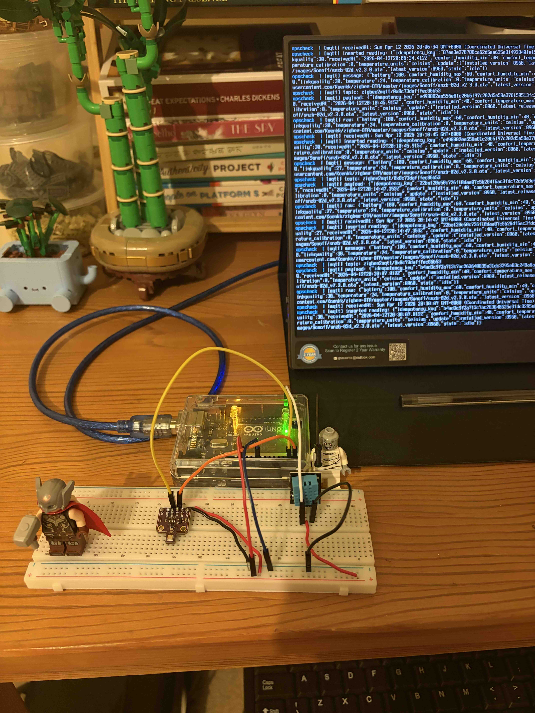
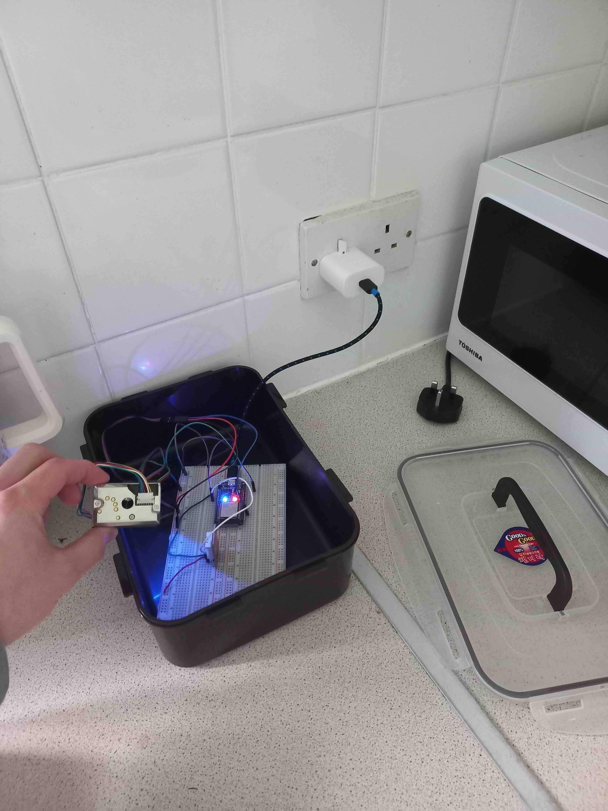
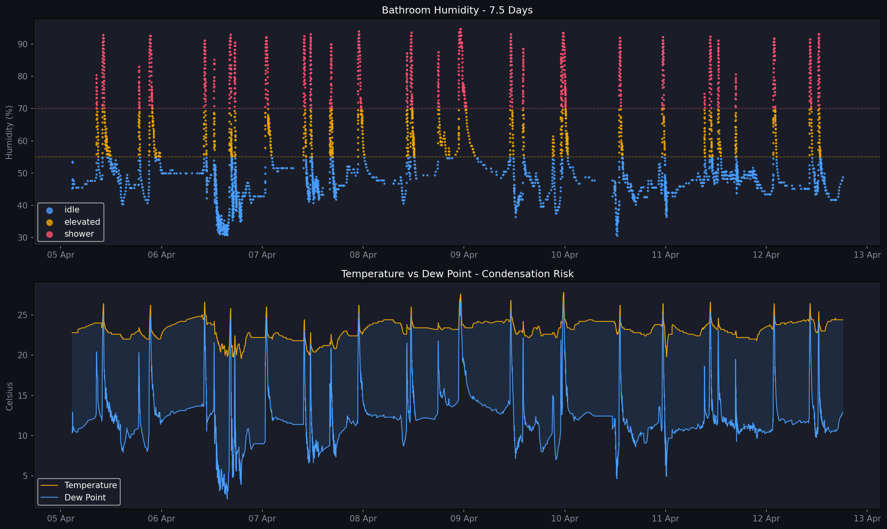
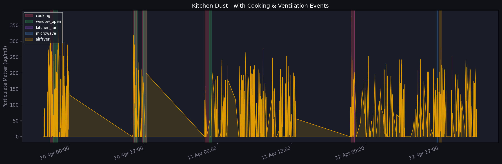

# IoT Sensor Analysis

Personal project exploring what you can extract from cheap home sensors — and where the limits are.

It started with a practical problem: mould forming in my bathroom. I wanted to understand why it was happening, and whether sensor data could help identify when conditions were becoming risky. Once the data pipeline was running, I expanded to the kitchen and living room.


---

## Hardware

**Bathroom** — Zigbee temperature/humidity sensor connected to a home server running Zigbee2MQTT and PostgreSQL. Data flows in automatically on value change.

**Kitchen** — ESP32 with a GP2Y dust sensor and DHT22 temperature/humidity sensor, deployed in a waterproof enclosure on the kitchen counter.

**Living room** — BME680 sensor (temperature, humidity, pressure, gas resistance).

<p align="center">
  
  
</p>
---

## Notebooks

### `humidity_analysis.ipynb` — Bathroom sensor
~5,000 readings over 7.5 days.

- Calculating dew point from raw sensor readings
- Identifying shower events using threshold-based labelling
- Linear regression to explore dew point prediction — and why the near-perfect R² here is expected, not impressive




---

### `kitchen_livingroom_analysis.ipynb` — Kitchen & living room
945 kitchen readings, 9,333 living room readings, 22 manually labelled events over 3 days.
Events were labelled across 3,000+ total sensor readings.

- Loading and cleaning kitchen sensor data (Korean timestamps, ADC conversion, warmup noise)
- Converting raw GP2Y ADC values to µg/m³
- Aligning manually logged events with sensor timestamps
- Visualising cooking and ventilation effects on air quality
- Living room air quality exploration



---

## Repo structure

```
iot-sensor-analysis/
├── README.md
├── .gitignore
├── humidity_analysis.ipynb
├── kitchen_livingroom_analysis.ipynb
├── images/
│   ├── hardware_dev.jpg
│   ├── hardware_kitchen.jpg
│   ├── humid_analysis.png
│   ├── kitchen_dust_timeline.png
│   ├── cooking_vs_idle.png
│   └── livingroom.png
└── data/
    ├── sample_bathroom_data.csv
    ├── sample_events/data.csv
    ├── sample_kitchen_data.csv
    └── sample_livingroom_data.csv
```

Full datasets available on request.

---

## What I was trying to learn
I'm a software engineer, not a data scientist. The data collection, pipeline, and labelling were my own work — I was present for each event, recorded timestamps manually, and made the judgement calls about what counted as a cooking event or a ventilation window. The ML analysis was exploratory: I used Scikit-learn to run classification and regression experiments, but the goal wasn't to build a production model. It was to understand what the pipeline actually involves — and where the gaps are.

The most useful things I took away:

**Labelling is harder and more important than model selection.** The analysis code took hours. Creating consistent labels took longer and required more discipline.

**What a metric measures and what you want to measure are often different things.** Episode duration in the bathroom analysis measures how long humidity stays elevated, not how long the shower ran. Without ventilation, those can be very different numbers.

**High accuracy can be misleading on imbalanced data.** Idle events make up ~90% of the dataset. A model that always predicted idle would be 90% accurate and completely useless. Macro F1 and per-class recall tell a more honest story.
